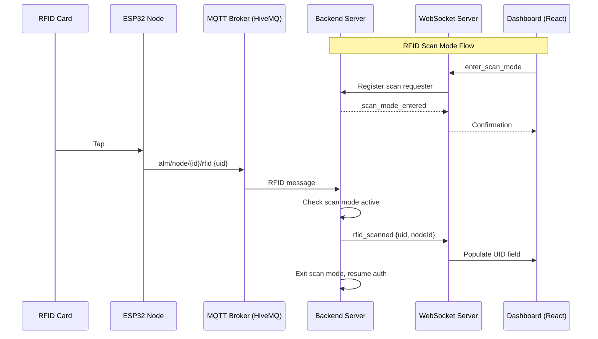
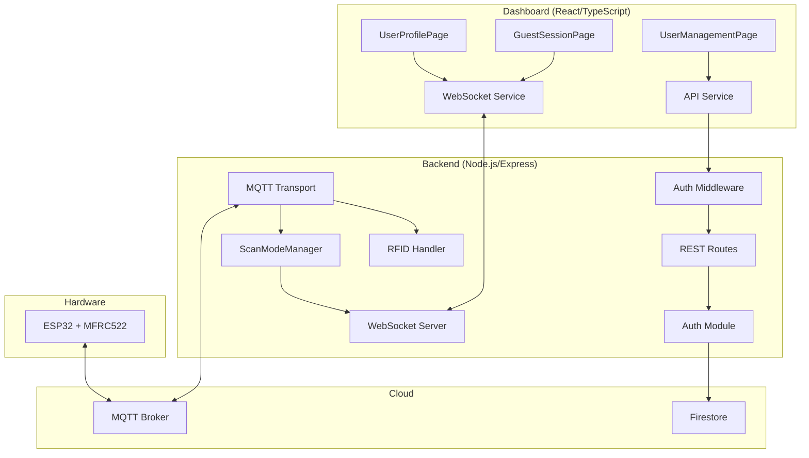

# Design Document: RFID Tap and User Management

## Overview

This design introduces three interconnected capabilities to the Smart Socket platform:

1. **RFID Tap-to-Capture** — Replaces manual RFID UID text entry on the User Profile page with a hardware-driven tap workflow. The dashboard enters a "scan mode" via WebSocket, the backend intercepts the next MQTT RFID event, and routes the captured UID back to the requesting client.

2. **RFID Tap-to-Assign Socket (Guest Mode)** — Extends the guest session page to use a physical RFID tap on a node to automatically identify and assign the socket, replacing the manual node selection dropdown.

3. **User Management Tab** — A new admin page listing all registered users with search, detail view, and delete capabilities, powered by new REST API endpoints.

The design builds on the existing architecture: MQTT transport for hardware events, WebSocket for real-time dashboard communication, Firebase Auth for API protection, and Firestore as the data store.

## Architecture

### High-Level Data Flow



### System Architecture Diagram



### Design Decisions

| Decision | Choice | Rationale |
|----------|--------|-----------|
| Scan mode scope | Single global lock (one scan at a time) | Simplicity; concurrent scans on a multi-reader system would create ambiguity about which reader to route |
| Scan mode transport | WebSocket messages (not REST) | Real-time bidirectional communication needed; scan results must push to client |
| Guest tap flow | Reuses same MQTT topic, no scan mode needed | Guest page listens for `rfid_tap` broadcasts; backend identifies source node and forwards |
| User management auth | Firebase Auth token on all endpoints | Consistent with existing auth middleware pattern |
| Timeout implementation | Backend timer + frontend timer (both 30s for scan, 60s for guest) | Defense-in-depth; either side can clean up if the other fails |
| User deletion guard | Check active sessions before delete | Prevents orphaned sessions with dangling user references |

## Components and Interfaces

### Backend Components

#### 1. ScanModeManager (New Module)

**Location:** `src/modules/scan-mode/scan-mode-manager.ts`

Manages the global RFID scan mode state. Only one client can be in scan mode at a time.

```typescript
export interface ScanModeState {
  active: boolean;
  requesterId: string | null;   // WebSocket client identifier
  enteredAt: number | null;     // Timestamp for timeout calculation
  timeoutHandle: NodeJS.Timeout | null;
}

export interface ScanResult {
  rfidUid: string;
  nodeId: string;
}

export class ScanModeManager {
  private state: ScanModeState;
  private readonly TIMEOUT_MS = 30_000;

  /** Enter scan mode for the given client. Returns false if already active. */
  enterScanMode(requesterId: string): boolean;

  /** Exit scan mode (cancel, timeout, or result delivered). */
  exitScanMode(): void;

  /** Check if scan mode is active. */
  isActive(): boolean;

  /** Get the current requester ID (null if not active). */
  getRequesterId(): string | null;

  /** Handle an incoming RFID event. Returns the requester ID if consumed, null otherwise. */
  consumeRfidEvent(rfidUid: string, nodeId: string): ScanResult | null;
}
```

#### 2. WebSocket Server Extension

**Location:** `src/modules/dashboard-api/websocket-server.ts` (modified)

Add per-client message handling and targeted messaging capabilities.

```typescript
// New methods added to WebSocketServer class:

/** Send a message to a specific client by ID. */
sendToClient(clientId: string, data: Record<string, unknown>): boolean;

/** Register a handler for incoming client messages. */
onClientMessage(handler: (clientId: string, message: WSIncomingMessage) => void): void;

/** Broadcast an rfid_tap event to all connected clients. */
emitRfidTap(nodeId: string, rfidUid: string): void;
```

Each WebSocket connection will be assigned a unique `clientId` (UUID) on connect, stored in a `Map<string, WebSocket>`.

#### 3. REST Routes Extension

**Location:** `src/modules/dashboard-api/rest-routes.ts` (modified)

New endpoints:

```typescript
// GET /api/users — List all users
router.get('/users', async (req, res) => { ... });

// DELETE /api/users/:userId — Delete a user
router.delete('/users/:userId', async (req, res) => { ... });
```

#### 4. UserProfileManager Extension

**Location:** `src/modules/auth/user-profile.ts` (modified)

New methods:

```typescript
/** List all user profiles from Firestore. */
async listAllUsers(): Promise<UserProfile[]>;

/** Delete a user profile and clear RFID associations. */
async deleteUser(userId: string): Promise<void>;

/** Check if a user has an active session. */
async hasActiveSession(userId: string): Promise<boolean>;
```

### Frontend Components

#### 1. RfidScanButton Component (New)

**Location:** `frontend/src/components/RfidScanButton.tsx`

Reusable button that initiates RFID scan mode via WebSocket.

```typescript
interface RfidScanButtonProps {
  onUidCaptured: (uid: string) => void;
  onError?: (message: string) => void;
  disabled?: boolean;
}

// States: idle | scanning | captured | timeout | error
```

#### 2. UserManagementPage (New)

**Location:** `frontend/src/pages/UserManagementPage.tsx`

Admin page listing all users with search and delete actions.

#### 3. GuestSessionPage (Modified)

Replace the node selection dropdown with an RFID tap listening flow. The page broadcasts that it's ready, and when an `rfid_tap` WebSocket message arrives with a node identifier, it auto-selects that node.

#### 4. useRfidScan Hook (New)

**Location:** `frontend/src/hooks/useRfidScan.ts`

Encapsulates scan mode WebSocket messaging and state machine.

```typescript
interface UseRfidScanReturn {
  status: 'idle' | 'scanning' | 'timeout' | 'error';
  startScan: () => void;
  cancelScan: () => void;
  lastError: string | null;
}

function useRfidScan(onUidCaptured: (uid: string, nodeId: string) => void): UseRfidScanReturn;
```

### WebSocket Message Protocol

#### Client → Server Messages

| Type | Payload | Purpose |
|------|---------|---------|
| `enter_scan_mode` | `{}` | Request to enter RFID scan mode |
| `cancel_scan_mode` | `{}` | Cancel active scan mode |

#### Server → Client Messages

| Type | Payload | Purpose |
|------|---------|---------|
| `scan_mode_entered` | `{}` | Confirmation that scan mode is active |
| `scan_in_progress` | `{ error: string }` | Rejection: another client scanning |
| `rfid_scanned` | `{ rfidUid: string, nodeId: string }` | Scan result (targeted to requester) |
| `scan_mode_timeout` | `{}` | 30s timeout expired (targeted to requester) |
| `rfid_tap` | `{ rfidUid: string, nodeId: string }` | Broadcast tap event (for guest mode) |

## Data Models

### Existing Model: UserProfile (Firestore `users` collection)

```typescript
interface UserProfile {
  userId: string;               // Document ID
  name: string;
  evType: '2-wheeler' | '4-wheeler';
  brand: string;
  batteryCapacity: number;      // kWh
  batteryType: string;
  chargerType: string;
  chargerPowerRating: number;   // kW
  rfidUids: string[];           // Max 5 entries
  createdAt: number;            // Unix timestamp ms
  updatedAt: number;            // Unix timestamp ms
}
```

No schema changes needed. The existing model already supports multiple RFID UIDs.

### In-Memory State: ScanModeState

```typescript
interface ScanModeState {
  active: boolean;
  requesterId: string | null;
  enteredAt: number | null;
  timeoutHandle: NodeJS.Timeout | null;
}
```

This is purely in-memory — no persistence needed. If the server restarts, scan mode is naturally reset.

### API Response Models

#### GET /api/users Response

```typescript
interface UsersListResponse {
  users: Array<{
    userId: string;
    name: string;
    evType: '2-wheeler' | '4-wheeler';
    brand: string;
    rfidUids: string[];
    createdAt: number;
  }>;
}
```

#### Error Responses

```typescript
interface ErrorResponse {
  error: string;
}
```

Status codes:
- `401` — Missing or invalid auth token
- `404` — User not found (DELETE)
- `409` — User has active session (DELETE blocked)


## Correctness Properties

*A property is a characteristic or behavior that should hold true across all valid executions of a system — essentially, a formal statement about what the system should do. Properties serve as the bridge between human-readable specifications and machine-verifiable correctness guarantees.*

### Property 1: Scan Mode Mutual Exclusion

*For any* two distinct client IDs, if `enterScanMode(clientA)` returns true (scan mode activated), then `enterScanMode(clientB)` MUST return false, and `getRequesterId()` MUST still equal `clientA`.

**Validates: Requirements 1.8, 4.5**

### Property 2: Scan Mode Intercepts RFID Events

*For any* RFID UID string and node ID, when `isActive()` is true, calling `consumeRfidEvent(rfidUid, nodeId)` MUST return a non-null `ScanResult` with `rfidUid` and `nodeId` matching the inputs.

**Validates: Requirements 1.2, 1.7, 4.2**

### Property 3: Scan Mode Auto-Exits on Result Delivery

*For any* RFID UID consumed during active scan mode (i.e., `consumeRfidEvent` returns non-null), immediately after that call, `isActive()` MUST return false.

**Validates: Requirements 4.3**

### Property 4: Post-Exit RFID Events Pass Through

*For any* RFID UID and node ID, after `exitScanMode()` has been called (or after scan mode auto-exits from result delivery), calling `consumeRfidEvent(rfidUid, nodeId)` MUST return null, indicating the event is not intercepted and flows to normal authentication.

**Validates: Requirements 1.10, 4.6**

### Property 5: RFID UID List Bounded at 5

*For any* user profile, the `rfidUids` array MUST never exceed 5 entries. Adding a UID when the array already contains 5 entries MUST be rejected.

**Validates: Requirements 1.6**

### Property 6: Scan State Machine Transitions (Frontend)

*For any* scan state that is `'scanning'`:
- Receiving an `rfid_scanned` message with a valid UID MUST transition the state to `'idle'` and the captured UID MUST equal the received UID.
- Invoking `cancelScan()` MUST transition the state to `'idle'` and the captured UID MUST remain empty/unchanged.

**Validates: Requirements 1.3, 1.5**

### Property 7: Guest Page Node Assignment from RFID Tap

*For any* valid `rfid_tap` WebSocket message containing a `nodeId` that corresponds to an available node, when the guest session page is in the RFID listening state, the assigned node field MUST be populated with the received `nodeId`.

**Validates: Requirements 2.3**

### Property 8: Unavailable Node Rejection Keeps Listening State

*For any* `rfid_tap` message where the node is unavailable (offline, occupied, or in temperature override), the guest session page MUST remain in the RFID listening state and MUST NOT assign the node.

**Validates: Requirements 2.4**

### Property 9: User Search Filter Correctness

*For any* non-empty search string and list of user profiles, every user in the filtered result MUST have either a `name` or `brand` that contains the search string (case-insensitive), and no user matching the criteria should be excluded from the results.

**Validates: Requirements 3.3**

### Property 10: User Deletion Removes Profile and Frees RFIDs

*For any* existing user ID without an active session, after calling `deleteUser(userId)`, the user MUST NOT appear in `listAllUsers()` results, and the deleted user's former RFID UIDs MUST NOT be associated with any user (freeing them for re-assignment).

**Validates: Requirements 3.6, 5.2, 5.4**

### Property 11: Delete Blocked When User Has Active Session

*For any* user ID that has an active charging session, attempting to delete that user MUST fail with a 409 status and the user profile MUST remain unchanged in the database.

**Validates: Requirements 5.5**

### Property 12: User List API Response Shape

*For any* set of user profiles stored in the database, `GET /api/users` MUST return a JSON response where the `users` array length equals the total number of stored profiles, and each entry MUST contain the fields: `userId`, `name`, `evType`, `brand`, `rfidUids` (array), and `createdAt` (number).

**Validates: Requirements 5.1**

## Error Handling

### Backend Error Scenarios

| Scenario | Handling | Response |
|----------|----------|----------|
| `enter_scan_mode` while another scan active | Reject with `scan_in_progress` | WebSocket error message to requester |
| Scan requester WebSocket disconnects | Auto-exit scan mode, resume auth | No response (client gone) |
| 30s scan timeout | Auto-exit scan mode, notify client | `scan_mode_timeout` WebSocket message |
| DELETE user with active session | Block deletion | HTTP 409 with error message |
| DELETE non-existent user | Not found | HTTP 404 with error message |
| GET/DELETE without auth token | Reject at middleware | HTTP 401 |
| Firestore read failure on user list | Internal error | HTTP 500 with generic error |
| MQTT message arrives with malformed UID | Log warning, skip processing | No client notification |
| WebSocket send to disconnected client | Catch error, clean up client map | Remove client from active set |

### Frontend Error Scenarios

| Scenario | Handling | UX |
|----------|----------|-----|
| WebSocket disconnects during scan | Exit scan mode, revert UI | Show "Connection lost" toast, revert to idle |
| Scan timeout (30s) | Revert to idle state | Show "Scan timed out" message with tap button |
| Guest tap timeout (60s) | Show retry option | Show "Timeout" message with "Retry" button |
| Node unavailable on guest tap | Stay in listening state | Show specific reason (offline/occupied/override) |
| API error on user delete | Show error toast | Display error message, keep user in list |
| API error on user list fetch | Show error state | Display retry option with error message |

### Graceful Degradation

- If the WebSocket connection is lost, the frontend falls back to manual RFID UID text entry (the input field remains editable)
- If the backend cannot connect to MQTT, scan mode cannot capture UIDs but the REST API continues to function
- If Firestore is temporarily unavailable, user list/delete operations return 500 but scan mode (in-memory) continues to work

## Testing Strategy

### Property-Based Testing (PBT)

The project already has `fast-check` configured for both backend and frontend. Property-based tests will validate the correctness properties defined above.

**Backend PBT (vitest + fast-check):**
- `ScanModeManager` state machine properties (Properties 1-4)
- User profile RFID UID bounds (Property 5)
- User search filter logic (Property 9)
- User deletion invariants (Properties 10-11)
- API response shape validation (Property 12)

**Frontend PBT (vitest + fast-check):**
- Scan state machine transitions (Property 6)
- Guest page node assignment logic (Properties 7-8)

**Configuration:**
- Minimum 100 iterations per property test
- Each test tagged with: `Feature: rfid-tap-and-user-management, Property {N}: {title}`

### Unit Tests (Example-Based)

- `ScanModeManager`: Enter/exit lifecycle, timeout firing, disconnect cleanup
- `WebSocket Server`: Client tracking, targeted message delivery, broadcast
- `REST routes`: 401 without token, 404 for missing user, 409 for active session
- `RfidScanButton`: Render states (idle, scanning, timeout, error)
- `UserManagementPage`: Render user list, confirmation dialog on delete
- `GuestSessionPage`: RFID listening indicator, node assignment UI

### Integration Tests

- End-to-end scan mode flow: WebSocket enter → MQTT RFID message → WebSocket result delivery
- User CRUD: Create user → List → Delete → Verify gone
- Guest tap flow: MQTT RFID message → WebSocket broadcast → Frontend receives rfid_tap
- Auth middleware: Verify 401 for unauthenticated requests to /api/users

### Test File Organization

```
tests/
├── property/
│   ├── scan-mode-manager.property.test.ts
│   ├── user-search-filter.property.test.ts
│   ├── user-deletion.property.test.ts
│   └── api-response-shape.property.test.ts
├── unit/
│   ├── scan-mode-manager.test.ts
│   ├── websocket-server.test.ts
│   └── rest-routes-users.test.ts
└── integration/
    ├── scan-mode-flow.test.ts
    └── user-management-flow.test.ts

frontend/src/
├── hooks/__tests__/
│   └── useRfidScan.property.test.ts
├── pages/__tests__/
│   ├── GuestSessionPage.property.test.ts
│   └── UserManagementPage.test.tsx
└── components/__tests__/
    └── RfidScanButton.test.tsx
```
