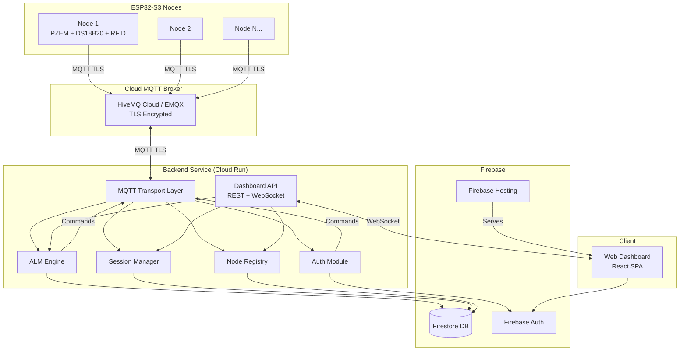
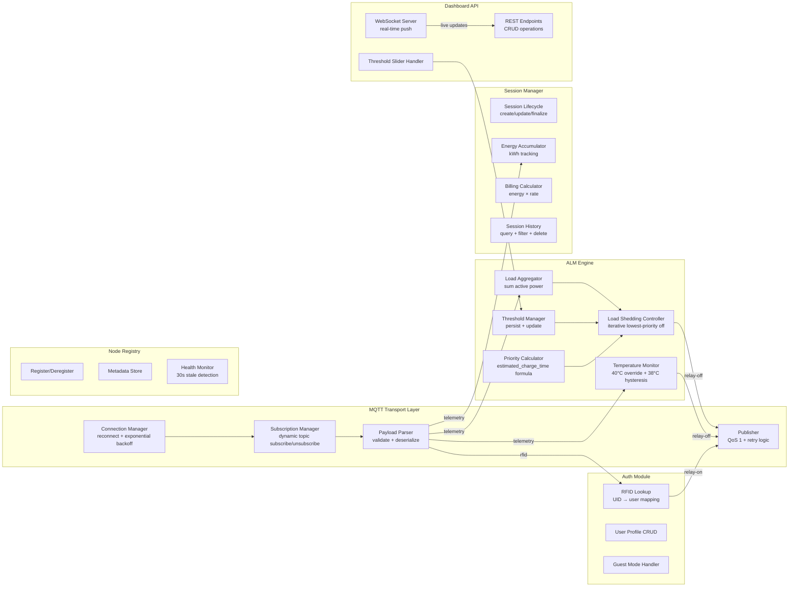
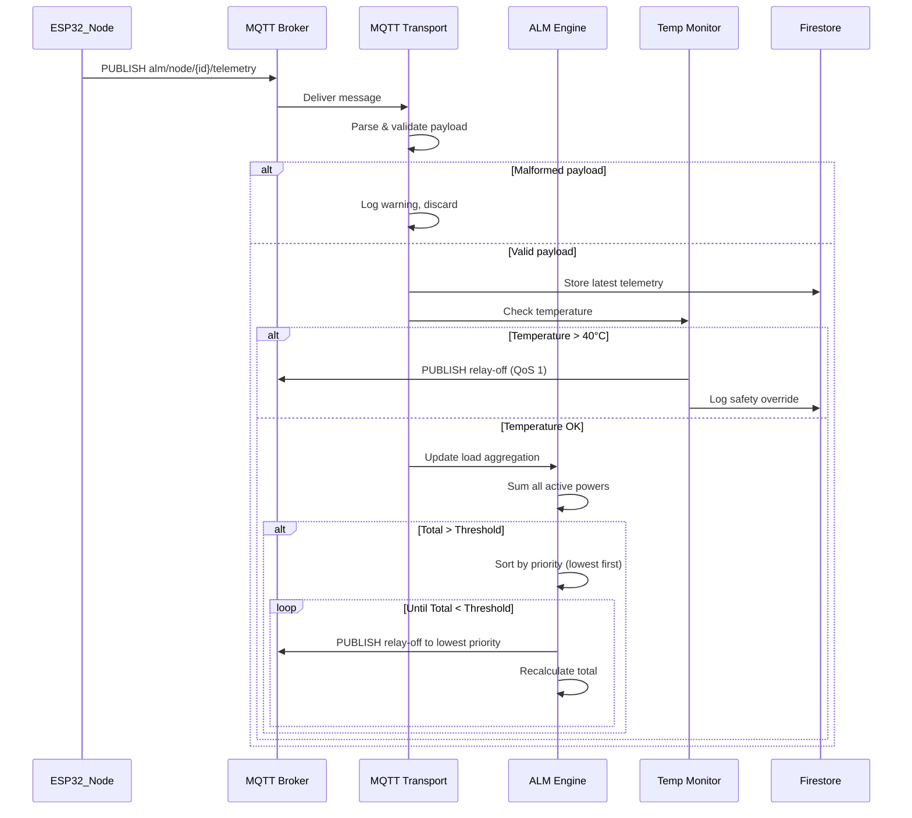

# Design Document: Smart Socket Backend

## Overview

This design describes the backend system for the ESP32-S3 Smart Socket EV Charging Platform (Phase 1). The backend is a cloud-hosted Node.js application that acts as the central intelligence layer between ESP32-S3 hardware nodes and the web dashboard. It receives real-time telemetry via MQTT, executes Adaptive Load Management (ALM) decisions, authenticates users through RFID, manages charging sessions with billing, and serves a real-time dashboard over WebSockets.

### Key Design Decisions

1. **Node.js + TypeScript**: Chosen for event-driven MQTT handling, strong ecosystem for real-time WebSocket communication, and Firebase SDK compatibility.
2. **Firebase (Firestore + Auth + Hosting)**: Cloud platform providing managed NoSQL database, user authentication, and static hosting — no server management overhead.
3. **Cloud Functions or Cloud Run**: Stateful backend process for MQTT connection (Cloud Run preferred for persistent connections vs Cloud Functions' cold start limitations).
4. **MQTT.js client library**: Well-maintained Node.js MQTT client with QoS support and automatic reconnection.
5. **Modular service architecture**: Each concern (MQTT transport, ALM engine, auth, sessions, device registry, dashboard API) is an independent module with defined interfaces, enabling Phase 2 CAN bus transition by swapping only the transport layer.

---

## Architecture

### High-Level Architecture (HLD)



### Low-Level Architecture (LLD)



### Data Flow: Telemetry Ingestion to ALM Decision



---

## Components and Interfaces

### 1. MQTT Transport Layer

**Responsibility**: Manages all MQTT communication — connection lifecycle, subscriptions, publishing, and payload parsing.

```typescript
interface IMqttTransport {
  connect(): Promise<void>;
  disconnect(): Promise<void>;
  subscribe(nodeId: string): void;
  unsubscribe(nodeId: string): void;
  publishCommand(nodeId: string, command: RelayCommand): Promise<DeliveryStatus>;
  onTelemetry(handler: (nodeId: string, payload: TelemetryPayload) => void): void;
  onRfidScan(handler: (nodeId: string, uid: string) => void): void;
}

interface RelayCommand {
  relay_state: "on" | "off";
  timestamp: number;
  reason: "alm" | "safety" | "user" | "auth";
}

interface DeliveryStatus {
  delivered: boolean;
  attempts: number;
  timestamp: number;
}
```

**Design Notes**:
- Connection Manager: Implements exponential backoff reconnection (1s, 2s, 4s, 8s... max 60s).
- Publisher: QoS 1 with 5-second ACK timeout, 3 retries before logging failure.
- Subscription Manager: Dynamically subscribes/unsubscribes per node registration.
- Payload Parser: Validates all required fields exist and are numeric; discards malformed payloads with logging.

### 2. ALM Engine

**Responsibility**: Core decision-making module — aggregates load, compares to threshold, executes load shedding by priority.

```typescript
interface IAlmEngine {
  updateLoad(nodeId: string, power: number): void;
  getTotalLoad(): number;
  getThreshold(): number;
  setThreshold(value: number): Promise<void>;
  evaluateAndShed(): Promise<ShedResult[]>;
  getNodePriority(nodeId: string): number;
}

interface ShedResult {
  nodeId: string;
  reason: "alm_overload";
  priorityScore: number;
  timestamp: number;
}
```

### 3. Temperature Safety Monitor

**Responsibility**: Independent safety layer with highest precedence — triggers immediate relay-off on temperature breach.

```typescript
interface ITemperatureMonitor {
  checkTemperature(nodeId: string, temperature: number): SafetyAction;
  isInOverrideState(nodeId: string): boolean;
  canReactivate(nodeId: string, temperature: number): boolean;
}

type SafetyAction = 
  | { action: "none" }
  | { action: "shutdown"; reason: "temperature_exceeded"; temperature: number }
  | { action: "block_reactivation"; reason: "hysteresis_active"; temperature: number };
```

**Design Notes**:
- Override triggered at >40°C (strict greater than).
- Reactivation allowed only when temperature drops below 38°C (2°C hysteresis band).
- State tracked per-node in memory with persistence to Firestore for crash recovery.

### 4. Priority Calculator

**Responsibility**: Computes priority scores for active sessions.

```typescript
interface IPriorityCalculator {
  calculatePriority(session: SessionParams): number;
  resolveTieBreaker(sessions: ActiveSession[]): string; // returns nodeId to shed
}

interface SessionParams {
  batteryCapacity: number;  // kWh
  initialSOC: number;       // 0-1 (defaults to 0.20 if not provided)
  chargerPowerRating: number; // kW
  isGuest: boolean;
  guestSpecsProvided: boolean;
}
```

**Priority Formula**:
```
estimated_charge_time = (battery_capacity × (1 - initial_SOC)) / charger_power_rating
```

- Guest without specs → priority = 0
- Guest with specs → use formula
- Missing SOC → default to 0.20
- Tie-breaker: longest continuous running duration shed first

### 5. Session Manager

**Responsibility**: Manages session lifecycle from creation to finalization with billing.

```typescript
interface ISessionManager {
  createSession(params: CreateSessionParams): Promise<Session>;
  updateSessionEnergy(nodeId: string, powerWatts: number, durationMs: number): void;
  finalizeSession(nodeId: string, reason: SessionEndReason): Promise<FinalizedSession>;
  getActiveSession(nodeId: string): Session | null;
  getSessionHistory(userId: string, filters?: SessionFilters): Promise<Session[]>;
  deleteSession(sessionId: string): Promise<void>;
  clearHistory(userId: string): Promise<void>;
}

type SessionEndReason = "user_ended" | "alm_override" | "safety_override" | "admin_action";

interface FinalizedSession {
  sessionId: string;
  totalTime: number;         // seconds
  totalEnergy: number;       // kWh
  billAmount: number;        // currency
  endReason: SessionEndReason;
}
```

### 6. Auth Module (RFID + User Profiles)

**Responsibility**: Handles RFID-based authentication and user profile CRUD.

```typescript
interface IAuthModule {
  authenticateRfid(nodeId: string, rfidUid: string): Promise<AuthResult>;
  createUser(profile: UserProfileInput): Promise<UserProfile>;
  updateUser(userId: string, updates: Partial<UserProfileInput>): Promise<UserProfile>;
  getUserByRfid(rfidUid: string): Promise<UserProfile | null>;
  assignRfid(userId: string, rfidUid: string): Promise<void>;
}

interface AuthResult {
  success: boolean;
  userId?: string;
  error?: string;
  responseTime: number; // must be < 3000ms
}

interface UserProfileInput {
  name: string;
  evType: "2-wheeler" | "4-wheeler";
  brand: string;
  batteryCapacity: number;   // kWh (required)
  batteryType: string;
  chargerType: string;
  chargerPowerRating: number; // kW (required)
  rfidUids: string[];
}
```

### 7. Node Registry

**Responsibility**: Manages ESP32 node registration, metadata, and health monitoring.

```typescript
interface INodeRegistry {
  registerNode(params: RegisterNodeParams): Promise<NodeRecord>;
  deregisterNode(nodeId: string): Promise<void>;
  getNode(nodeId: string): NodeRecord | null;
  getAllActiveNodes(): NodeRecord[];
  updateLastSeen(nodeId: string, timestamp: number): void;
  getStaleNodes(thresholdMs: number): NodeRecord[];  // default 30000ms
}

interface NodeRecord {
  nodeId: string;
  displayName: string;
  locationLabel: string;
  registrationDate: number;
  active: boolean;
  lastSeenTimestamp: number;
  inTemperatureOverride: boolean;
}
```

### 8. Dashboard API (REST + WebSocket)

**Responsibility**: Serves dashboard data and handles real-time updates.

```typescript
interface IDashboardApi {
  // REST endpoints
  getNodes(): NodeRecord[];
  getNodeTelemetry(nodeId: string): TelemetryPayload;
  getActiveSessions(): Session[];
  getUserSessions(userId: string, filters?: SessionFilters): Session[];
  setThreshold(value: number): void;
  registerNode(params: RegisterNodeParams): NodeRecord;
  
  // WebSocket events (push to clients)
  emitTelemetryUpdate(nodeId: string, payload: TelemetryPayload): void;
  emitNodeStatusChange(nodeId: string, status: NodeStatus): void;
  emitAlmEvent(event: AlmEvent): void;
  emitSessionUpdate(session: Session): void;
}
```

---

## Data Models

### Firestore Collections

#### `nodes` Collection
```typescript
interface NodeDocument {
  nodeId: string;              // document ID
  displayName: string;
  locationLabel: string;
  registrationDate: Timestamp;
  active: boolean;
  lastTelemetry: TelemetryPayload | null;
  lastSeenTimestamp: Timestamp;
  inTemperatureOverride: boolean;
  temperatureOverrideSince: Timestamp | null;
}
```

#### `users` Collection
```typescript
interface UserDocument {
  userId: string;              // document ID
  name: string;
  evType: "2-wheeler" | "4-wheeler";
  brand: string;
  batteryCapacity: number;     // kWh
  batteryType: string;
  chargerType: string;
  chargerPowerRating: number;  // kW
  rfidUids: string[];          // array of associated RFID UIDs
  createdAt: Timestamp;
  updatedAt: Timestamp;
}
```

#### `sessions` Collection
```typescript
interface SessionDocument {
  sessionId: string;           // document ID
  userId: string;              // reference to users collection
  nodeId: string;              // reference to nodes collection
  sessionType: "owner" | "guest";
  startTimestamp: Timestamp;
  endTimestamp: Timestamp | null;
  initialSOC: number;          // 0-1, default 0.20
  batteryCapacity: number;     // kWh (from user profile or guest input)
  chargerPowerRating: number;  // kW
  priorityScore: number;
  totalEnergyConsumed: number; // kWh, accumulated during session
  totalTime: number;           // seconds
  billAmount: number | null;   // calculated at session end
  endReason: SessionEndReason | null;
  active: boolean;
  guestSpecs: GuestSpecs | null;
}

interface GuestSpecs {
  batteryCapacity: number;
  batteryType: string;
  chargerType: string;
  chargerPowerRating: number;
}
```

#### `config` Collection
```typescript
interface ConfigDocument {
  loadThreshold: number;       // watts
  perUnitRate: number;         // currency per kWh
  updatedAt: Timestamp;
  updatedBy: string;           // admin userId
}
```

#### `commandLog` Collection
```typescript
interface CommandLogDocument {
  commandId: string;           // document ID
  nodeId: string;
  commandType: "relay_on" | "relay_off";
  reason: "alm" | "safety" | "user" | "auth";
  timestamp: Timestamp;
  deliveryStatus: "pending" | "delivered" | "failed";
  attempts: number;
  relayState: "on" | "off";
}
```

#### `telemetryLog` Collection (optional — for historical analysis)
```typescript
interface TelemetryLogDocument {
  nodeId: string;
  voltage: number;
  current: number;
  power: number;
  frequency: number;
  powerFactor: number;
  temperature: number;
  timestamp: Timestamp;
  receivedAt: Timestamp;
}
```

### MQTT Message Schemas

#### Telemetry Payload (`alm/node/{node_id}/telemetry`)
```json
{
  "v": 230.5,          // voltage (V)
  "i": 12.3,          // current (A)
  "p": 2835.15,       // power (W) — measured by PZEM
  "f": 50.0,          // frequency (Hz)
  "pf": 0.98,         // power factor
  "t": 35.2,          // temperature (°C)
  "ts": 1690001234    // unix timestamp (seconds)
}
```

#### Relay Command (`alm/node/{node_id}/command`)
```json
{
  "relay_state": "off",
  "timestamp": 1690001240,
  "reason": "safety"
}
```

#### RFID Scan (`alm/node/{node_id}/rfid`)
```json
{
  "uid": "A1B2C3D4",
  "ts": 1690001235
}
```

#### Auth Response (`alm/node/{node_id}/auth_response`)
```json
{
  "authorized": true,
  "user_name": "John",
  "message": "Access Granted"
}
```

---


## Correctness Properties

*A property is a characteristic or behavior that should hold true across all valid executions of a system — essentially, a formal statement about what the system should do. Properties serve as the bridge between human-readable specifications and machine-verifiable correctness guarantees.*

### Property 1: Telemetry Parsing Round-Trip

*For any* valid telemetry JSON payload with fields (v, i, p, f, pf, t, ts), parsing the payload SHALL produce a structured TelemetryPayload object where each field matches the original JSON value exactly — including using the measured power `p` directly rather than computing V×I.

**Validates: Requirements 1.1, 1.5**

### Property 2: Malformed Payload Rejection

*For any* JSON payload that is missing one or more required telemetry fields (v, i, p, f, pf, t, ts) or contains non-numeric values for those fields, the parser SHALL reject the payload and return an error indicator without storing any data.

**Validates: Requirements 1.4**

### Property 3: Reconnection Exponential Backoff

*For any* number of consecutive connection failures N (where N ≥ 1), the computed reconnection delay SHALL equal min(2^N × baseDelay, maxDelay), following an exponential backoff pattern with a defined ceiling.

**Validates: Requirements 1.3**

### Property 4: Temperature Safety Override Trigger

*For any* ESP32_Node and any temperature value T where T > 40°C, the temperature monitor SHALL produce a "shutdown" action, regardless of the node's priority score, ALM state, or any other system condition.

**Validates: Requirements 3.1, 3.2**

### Property 5: Temperature Hysteresis State Machine

*For any* sequence of temperature readings for a node: (a) a reading > 40°C transitions the node INTO override state, (b) readings between 38°C and 40°C (inclusive) keep the node IN override state, (c) a reading < 38°C transitions the node OUT OF override state. Relay-on commands SHALL be rejected while in override state.

**Validates: Requirements 3.4**

### Property 6: Total Load Aggregation

*For any* set of N active ESP32_Nodes with power values [p₁, p₂, ..., pₙ], the computed Total_Transformer_Load SHALL equal the sum p₁ + p₂ + ... + pₙ, excluding nodes that are inactive or in temperature override.

**Validates: Requirements 4.1**

### Property 7: ALM Shedding Selects Lowest Priority

*For any* set of active sockets where Total_Transformer_Load exceeds Load_Threshold, the ALM engine SHALL select the socket with the lowest Priority_Score for shedding. If multiple sockets share the lowest priority, the one with the longest continuous running duration SHALL be selected.

**Validates: Requirements 4.2, 5.4**

### Property 8: ALM Post-Condition — Load Below Threshold

*For any* set of active sockets where Total_Transformer_Load exceeds Load_Threshold, after the ALM shedding loop completes, the resulting Total_Transformer_Load of remaining active sockets SHALL be less than or equal to the Load_Threshold (provided sufficient sockets can be shed).

**Validates: Requirements 4.3**

### Property 9: Priority Score Formula Correctness

*For any* valid session parameters (battery_capacity > 0, initial_SOC ∈ [0,1], charger_power_rating > 0), the calculated Priority_Score SHALL equal `(battery_capacity × (1 - initial_SOC)) / charger_power_rating`. If initial_SOC is not provided, it SHALL default to 0.20. Guest sessions with specs SHALL use the same formula.

**Validates: Requirements 5.1, 5.2, 12.2**

### Property 10: Guest Without Specs Priority Is Zero

*For any* guest session started without providing EV specifications, the assigned Priority_Score SHALL be exactly 0 (static lowest priority), regardless of any other system state.

**Validates: Requirements 5.3, 12.3**

### Property 11: RFID Authentication — Registered User Success Path

*For any* RFID_UID that exists in the user database, authentication SHALL succeed and produce a result containing the associated user_id, trigger a relay-on command for that node, and create a session record.

**Validates: Requirements 6.2**

### Property 12: RFID Authentication — Unregistered UID Denial

*For any* RFID_UID that does NOT exist in the user database, authentication SHALL fail, produce an access-denied response, and NOT trigger a relay-on command or create a session.

**Validates: Requirements 6.3**

### Property 13: User Profile Validation

*For any* user profile input where one or more required fields (name, battery_capacity, charger_power_rating) are missing or invalid, profile creation SHALL be rejected with an error message that identifies exactly which required fields are missing.

**Validates: Requirements 7.4, 7.5**

### Property 14: User Profile Round-Trip

*For any* valid user profile input (with all required fields), creating the profile and then retrieving it SHALL return an object with all original field values preserved, a unique user_id assigned, and associated RFID UIDs intact.

**Validates: Requirements 7.1, 7.2**

### Property 15: Energy Accumulation Correctness

*For any* sequence of telemetry readings with power values [p₁, p₂, ..., pₙ] received at time intervals [Δt₁, Δt₂, ..., Δtₙ], the accumulated session energy SHALL equal Σ(pᵢ × Δtᵢ) converted to kWh (divided by 3,600,000 if power is in watts and time in milliseconds).

**Validates: Requirements 8.2**

### Property 16: Session Bill Calculation

*For any* finalized session with total energy consumed E (kWh) and configured per-unit rate R, the Session_Bill SHALL equal E × R.

**Validates: Requirements 8.3, 8.5**

### Property 17: Session Deletion Removes From History

*For any* session that is deleted, subsequent queries to session history SHALL NOT include that session in results.

**Validates: Requirements 9.2**

### Property 18: Session Filter Correctness

*For any* set of sessions and any combination of filter criteria (date range, session_type, node_id), the returned results SHALL contain exactly those sessions that match ALL specified filter criteria — no more, no less.

**Validates: Requirements 9.4**

### Property 19: Command Message Format and Retry

*For any* relay command issued to a node, the published MQTT message SHALL use topic `alm/node/{node_id}/command` with QoS 1, and if not acknowledged within 5 seconds, SHALL retry up to 3 times before logging failure. The total attempts SHALL never exceed 4 (1 initial + 3 retries).

**Validates: Requirements 10.1, 10.2, 10.3**

### Property 20: Node Staleness Detection

*For any* registered ESP32_Node whose last telemetry timestamp is more than 30 seconds older than the current time, the system SHALL report that node as "stale" or "offline".

**Validates: Requirements 13.5**

### Property 21: Dashboard Authentication Enforcement

*For any* Dashboard API request that does not include valid authentication credentials, the Backend SHALL reject the request with an unauthorized status and NOT return any system data.

**Validates: Requirements 14.4**

### Property 22: Node Deregistration Exclusion

*For any* deregistered ESP32_Node, the node SHALL be marked inactive, excluded from Total_Transformer_Load calculations, and its MQTT topic subscriptions SHALL be removed.

**Validates: Requirements 2.2**

---

## Error Handling

### Error Categories and Strategies

| Error Category | Source | Strategy | Recovery |
|---|---|---|---|
| **MQTT Connection Loss** | Network failure, broker down | Exponential backoff reconnection (1s→60s max) | Auto-reconnect; log disconnection; resume subscriptions |
| **Malformed Telemetry** | ESP32 firmware bug, corruption | Discard payload, log warning with node_id | Continue processing other messages normally |
| **Command Delivery Failure** | Network issues, node offline | Retry up to 3 times (5s timeout each) | Log failure; ALM continues with stale state awareness |
| **Database Write Failure** | Firestore unavailable | Retry with backoff; buffer critical writes | In-memory state preserved; persist when DB recovers |
| **RFID Auth Timeout** | DB latency, network | 3-second deadline; fail-safe deny | Return access-denied to ESP32; log timeout |
| **Invalid User Input** | Dashboard forms | Field-level validation with descriptive errors | Return 400 with missing/invalid field list |
| **Temperature Sensor Fault** | Hardware failure | Last known value + stale detection (30s) | Mark node stale; do NOT assume safe temperature |
| **Priority Calculation Error** | Missing/invalid session params | Use defaults (SOC=0.20) or assign priority 0 | Log warning; never crash ALM loop |

### Critical Safety Rules

1. **Temperature override is fire-and-forget**: If temperature > 40°C, issue relay-off immediately. Do not wait for ACK to update internal state — assume the node is in override until proven otherwise.
2. **ALM failures fail-safe**: If the ALM engine encounters an error during shedding, it SHALL NOT issue relay-on commands. The system errs on the side of sockets staying off.
3. **Auth failures deny access**: Any error during RFID authentication results in access-denied. Never grant access on error.
4. **Stale telemetry is not safe telemetry**: If a node hasn't reported in 30+ seconds, treat its state as unknown. Do not use stale power values in ALM calculations — exclude the node.

### Error Logging Format

All errors are logged with:
- Timestamp (ISO 8601)
- Severity level (ERROR, WARN, INFO)
- Module origin (mqtt, alm, auth, session, registry)
- Node ID (when applicable)
- Error message and stack trace
- Context data (payload that caused the error, attempted operation)

---

## Testing Strategy

### Unit Tests (Example-Based)

Unit tests cover specific scenarios, edge cases, and integration points:

- **Telemetry parser**: Test with valid payloads, missing fields, wrong types, empty object, null values
- **Temperature override**: Test exact boundary (40.0°C, 40.01°C, 39.99°C, 38.0°C, 37.99°C)
- **Priority defaults**: Test SOC default (20%), guest mode (priority 0), missing charger rating
- **Session lifecycle**: Test create → accumulate → finalize flow with known values
- **RFID auth paths**: Test success, failure, and timeout scenarios
- **Threshold persistence**: Test set, restart simulation, verify retained value
- **ALM with zero nodes**: Test edge case of no active nodes
- **ALM with all nodes same priority**: Test tie-breaker by duration
- **Command retry exhaustion**: Test 3 retries then failure logged

### Property-Based Tests (Universal Properties)

Property-based testing validates universal correctness across randomly generated inputs. Using **fast-check** (TypeScript PBT library).

**Configuration:**
- Minimum 100 iterations per property test
- Each test tagged with: `Feature: smart-socket-backend, Property {N}: {title}`

**Properties to implement:**
1. Telemetry Parsing Round-Trip (Property 1)
2. Malformed Payload Rejection (Property 2)
3. Exponential Backoff Calculation (Property 3)
4. Temperature Safety Override Trigger (Property 4)
5. Temperature Hysteresis State Machine (Property 5)
6. Total Load Aggregation (Property 6)
7. ALM Shedding Selects Lowest Priority (Property 7)
8. ALM Post-Condition (Property 8)
9. Priority Score Formula (Property 9)
10. Guest Without Specs Priority Zero (Property 10)
11. User Profile Validation (Property 13)
12. User Profile Round-Trip (Property 14)
13. Energy Accumulation (Property 15)
14. Bill Calculation (Property 16)
15. Session Filter Correctness (Property 18)
16. Command Retry Logic (Property 19)
17. Node Staleness Detection (Property 20)
18. Node Deregistration Exclusion (Property 22)

### Integration Tests

Integration tests verify cross-module behavior and external service interactions:

- **MQTT end-to-end**: Connect to test broker, publish telemetry, verify processing
- **RFID → Session flow**: Publish RFID scan, verify auth + session creation + relay command
- **ALM → MQTT command flow**: Set threshold low, push high power telemetry, verify relay-off command published
- **Dashboard WebSocket**: Connect WebSocket client, push telemetry, verify real-time update received
- **Firestore persistence**: Write session, read back, verify consistency
- **Firebase Auth**: Test login flow, token validation, unauthorized access rejection

### Test Organization

```
tests/
├── unit/
│   ├── telemetry-parser.test.ts
│   ├── temperature-monitor.test.ts
│   ├── priority-calculator.test.ts
│   ├── alm-engine.test.ts
│   ├── session-manager.test.ts
│   ├── billing-calculator.test.ts
│   └── node-registry.test.ts
├── property/
│   ├── telemetry-parsing.property.ts
│   ├── temperature-safety.property.ts
│   ├── alm-shedding.property.ts
│   ├── priority-formula.property.ts
│   ├── energy-accumulation.property.ts
│   ├── session-filters.property.ts
│   └── command-retry.property.ts
└── integration/
    ├── mqtt-flow.integration.ts
    ├── rfid-auth-flow.integration.ts
    ├── alm-command-flow.integration.ts
    └── dashboard-websocket.integration.ts
```
