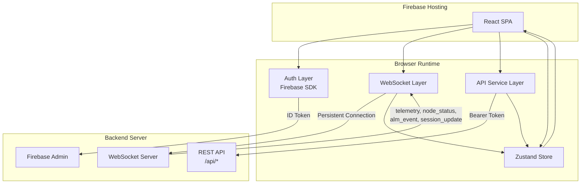
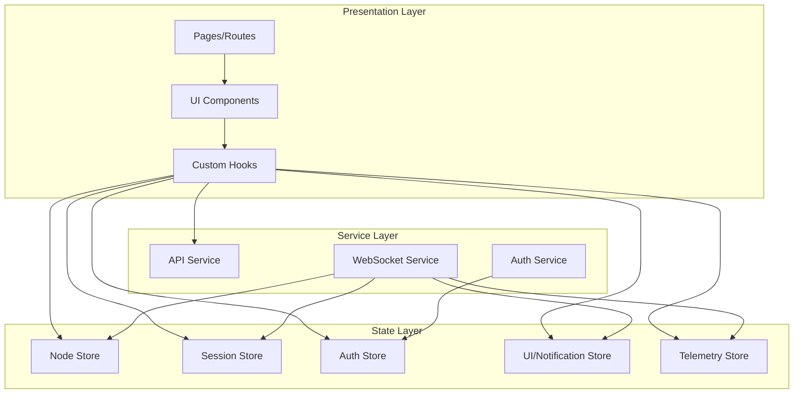
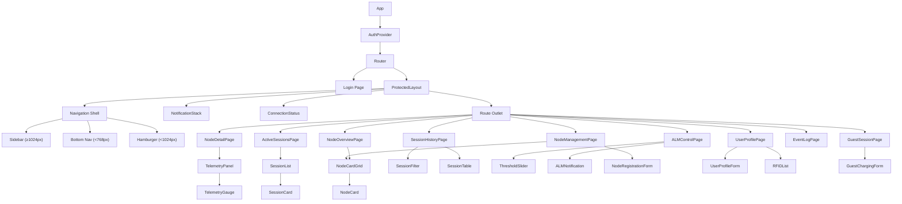
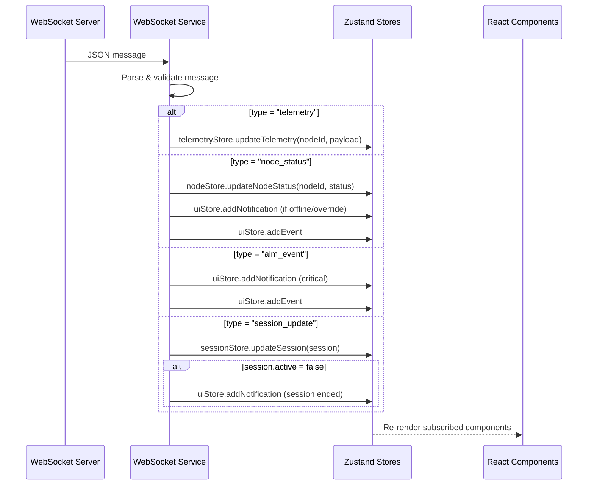
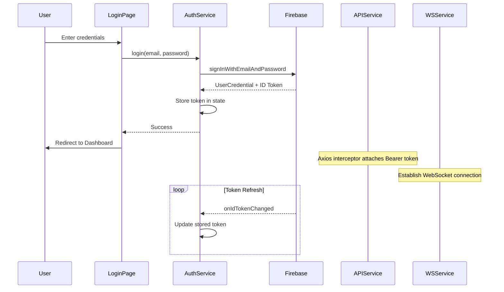
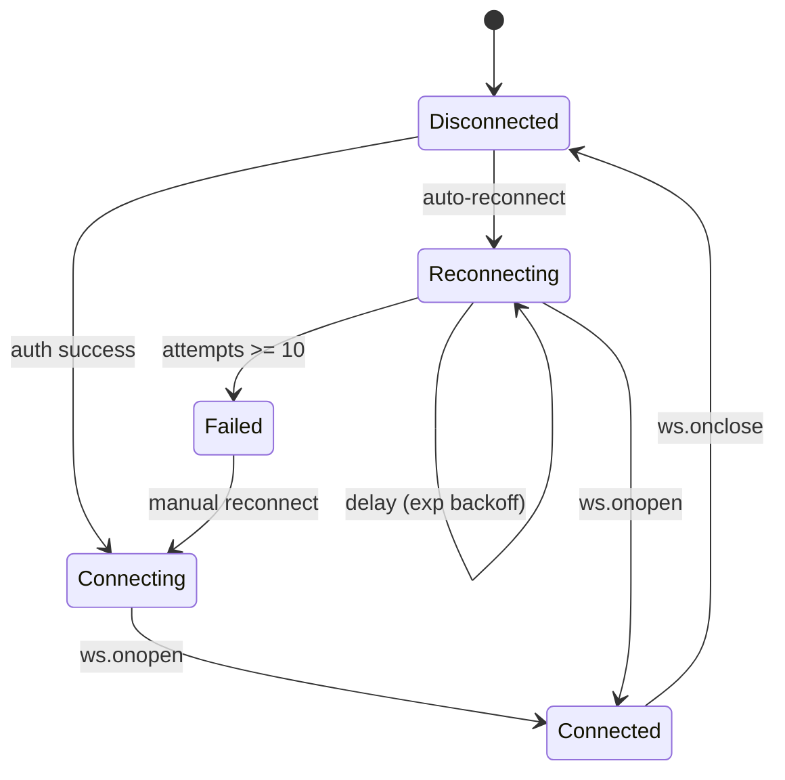

# Design Document: Smart Socket Dashboard

## Overview

The Smart Socket Dashboard is a React Single Page Application (SPA) that provides real-time monitoring and management of ESP32-S3 Smart Socket EV charging nodes. It connects to the existing Node.js/Express backend via REST API and WebSocket, authenticates users through Firebase Auth, and is deployed on Firebase Hosting.

### Key Design Decisions

| Decision | Choice | Rationale |
|----------|--------|-----------|
| Framework | React 18 with TypeScript | Type safety matches backend TS codebase; widely supported ecosystem |
| State Management | Zustand | Lightweight, minimal boilerplate, excellent TypeScript support; suitable for this scale |
| Routing | React Router v6 | De facto standard for React SPAs, supports protected routes |
| Styling | Tailwind CSS | Utility-first approach enables rapid responsive design without CSS-in-JS runtime cost |
| WebSocket Client | Native WebSocket API with custom hook | No external dependency needed; `ws` library is server-side only |
| HTTP Client | Axios | Interceptors simplify auth token attachment and error handling |
| Build Tool | Vite | Fast HMR, native TypeScript support, optimal for Firebase Hosting deployment |
| Testing | Vitest + React Testing Library + fast-check | Consistency with backend test tooling; fast-check for property-based tests |
| Form Handling | React Hook Form + Zod | Performant form handling with schema-based validation |

## Architecture

### High-Level Architecture



### Application Layer Diagram



### Routing Structure

```
/login                    → Login Page (public)
/                         → Dashboard Home / Node Overview (protected)
/nodes/:nodeId            → Node Detail / Telemetry Panel (protected)
/sessions/active          → Active Sessions (protected)
/sessions/history         → Session History (protected)
/profile                  → User Profile (protected)
/nodes/manage             → Node Management (protected)
/alm                      → ALM Threshold Control (protected)
/events                   → Event Log (protected)
/guest-session            → Guest Session Form (protected)
```

## Components and Interfaces

### Component Hierarchy



### Core Service Interfaces

```typescript
// src/services/api.service.ts
interface ApiService {
  // Nodes
  getNodes(): Promise<NodeRecord[]>;
  getNodeTelemetry(nodeId: string): Promise<{ nodeId: string; telemetry: TelemetryPayload }>;
  registerNode(params: RegisterNodeParams): Promise<NodeRecord>;
  deregisterNode(nodeId: string): Promise<void>;

  // Sessions
  getActiveSessions(): Promise<Session[]>;
  getUserSessions(userId: string, filters?: SessionFilters): Promise<Session[]>;
  startGuestSession(params: GuestSessionParams): Promise<Session>;
  deleteSession(sessionId: string): Promise<void>;

  // Config
  updateThreshold(value: number): Promise<{ threshold: number }>;

  // Users
  createUser(profile: UserProfileInput): Promise<UserProfile>;
  updateUser(userId: string, updates: Partial<UserProfileInput>): Promise<UserProfile>;
}

// src/services/websocket.service.ts
interface WebSocketService {
  connect(url: string): void;
  disconnect(): void;
  onMessage(handler: (message: WSMessage) => void): void;
  getStatus(): 'connected' | 'disconnected' | 'reconnecting';
}

// src/services/auth.service.ts
interface AuthService {
  login(email: string, password: string): Promise<User>;
  logout(): Promise<void>;
  getToken(): Promise<string | null>;
  onAuthStateChanged(callback: (user: User | null) => void): void;
}
```

### WebSocket Message Types

```typescript
type WSMessage =
  | { type: 'telemetry'; nodeId: string; payload: TelemetryPayload }
  | { type: 'node_status'; nodeId: string; status: 'online' | 'offline' | 'override' }
  | { type: 'alm_event'; event: { type: 'shedding'; nodeId: string; reason: string; timestamp: number } }
  | { type: 'session_update'; session: Session };
```

### Key Custom Hooks

```typescript
// Authentication guard
useAuth(): { user: User | null; loading: boolean; login; logout; token }

// WebSocket connection lifecycle
useWebSocket(): { status: ConnectionStatus; reconnect: () => void }

// Real-time telemetry for a specific node
useTelemetry(nodeId: string): { data: TelemetryPayload | null; lastUpdate: number; isStale: boolean }

// Notification management
useNotifications(): { notifications: Notification[]; add; dismiss; dismissAll }

// Node data and status
useNodes(): { nodes: NodeRecord[]; loading; error; refetch }

// Active sessions with live updates
useActiveSessions(): { sessions: Session[]; loading; error; refetch }
```

## Data Models

### Frontend Type Definitions

```typescript
// Mirrors backend models with frontend-specific additions

interface TelemetryPayload {
  voltage: number;
  current: number;
  power: number;
  frequency: number;
  powerFactor: number;
  temperature: number;
  timestamp: number;
}

interface NodeRecord {
  nodeId: string;
  displayName: string;
  locationLabel: string;
  registrationDate: number;
  active: boolean;
  lastSeenTimestamp: number;
  inTemperatureOverride: boolean;
}

type NodeStatus = 'online' | 'offline' | 'override';

interface Session {
  sessionId: string;
  userId: string;
  nodeId: string;
  sessionType: 'owner' | 'guest';
  startTimestamp: number;
  endTimestamp: number | null;
  initialSOC: number;
  batteryCapacity: number;
  chargerPowerRating: number;
  priorityScore: number;
  totalEnergyConsumed: number;
  totalTime: number;
  billAmount: number | null;
  endReason: string | null;
  active: boolean;
  guestSpecs: GuestSpecs | null;
}

interface GuestSpecs {
  batteryCapacity: number;
  batteryType: string;
  chargerType: string;
  chargerPowerRating: number;
}

interface UserProfile {
  userId: string;
  name: string;
  evType: '2-wheeler' | '4-wheeler';
  brand: string;
  batteryCapacity: number;
  batteryType: string;
  chargerType: string;
  chargerPowerRating: number;
  rfidUids: string[];
  createdAt: number;
  updatedAt: number;
}

interface UserProfileInput {
  name: string;
  evType: '2-wheeler' | '4-wheeler';
  brand: string;
  batteryCapacity: number;
  batteryType: string;
  chargerType: string;
  chargerPowerRating: number;
  rfidUids: string[];
}

interface RegisterNodeParams {
  nodeId: string;
  displayName: string;
  locationLabel: string;
}

interface GuestSessionParams {
  userId: string;
  nodeId: string;
  batteryCapacity?: number;
  chargerPowerRating?: number;
  initialSOC?: number;
  guestSpecs?: GuestSpecs;
}

interface SessionFilters {
  startDate?: number;
  endDate?: number;
  sessionType?: 'owner' | 'guest';
  nodeId?: string;
}
```

### Zustand Store Slices

```typescript
// Auth Store
interface AuthState {
  user: FirebaseUser | null;
  token: string | null;
  loading: boolean;
  error: string | null;
  login: (email: string, password: string) => Promise<void>;
  logout: () => Promise<void>;
  setUser: (user: FirebaseUser | null) => void;
  setToken: (token: string | null) => void;
}

// Node Store
interface NodeState {
  nodes: Map<string, NodeRecord>;
  nodeStatuses: Map<string, NodeStatus>;
  loading: boolean;
  error: string | null;
  fetchNodes: () => Promise<void>;
  updateNodeStatus: (nodeId: string, status: NodeStatus) => void;
  addNode: (node: NodeRecord) => void;
  removeNode: (nodeId: string) => void;
}

// Telemetry Store
interface TelemetryState {
  telemetryByNode: Map<string, TelemetryPayload>;
  lastUpdateByNode: Map<string, number>;
  totalLoad: number;
  updateTelemetry: (nodeId: string, payload: TelemetryPayload) => void;
}

// Session Store
interface SessionState {
  activeSessions: Session[];
  historyCache: Map<string, Session[]>;
  loading: boolean;
  error: string | null;
  fetchActiveSessions: () => Promise<void>;
  fetchUserSessions: (userId: string, filters?: SessionFilters) => Promise<void>;
  updateSession: (session: Session) => void;
  removeSession: (sessionId: string) => void;
}

// UI Store
interface UIState {
  notifications: Notification[];
  connectionStatus: 'connected' | 'disconnected' | 'reconnecting';
  eventLog: SystemEvent[];
  addNotification: (notification: Omit<Notification, 'id' | 'timestamp'>) => void;
  dismissNotification: (id: string) => void;
  setConnectionStatus: (status: 'connected' | 'disconnected' | 'reconnecting') => void;
  addEvent: (event: Omit<SystemEvent, 'id'>) => void;
}

interface Notification {
  id: string;
  type: 'success' | 'warning' | 'error' | 'info';
  title: string;
  message: string;
  timestamp: number;
  autoDismiss: boolean;
  autoDismissMs?: number;
}

interface SystemEvent {
  id: string;
  type: 'alm_shedding' | 'node_offline' | 'node_override' | 'session_ended';
  nodeId?: string;
  nodeName?: string;
  message: string;
  timestamp: number;
  severity: 'info' | 'warning' | 'critical';
}
```

### Data Flow: WebSocket Message Processing



### Data Flow: Authentication



## Correctness Properties

*A property is a characteristic or behavior that should hold true across all valid executions of a system — essentially, a formal statement about what the system should do. Properties serve as the bridge between human-readable specifications and machine-verifiable correctness guarantees.*

### Property 1: Auth token attachment

*For any* API request configuration (any URL path, any HTTP method, any request body), when the auth interceptor processes the request with a valid token in state, the resulting request headers SHALL contain `Authorization: Bearer {token}`.

**Validates: Requirements 1.2**

### Property 2: Display name truncation

*For any* string input, the truncateDisplayName function SHALL produce an output that is at most 33 characters long (30 + "..."). If the input length is ≤ 30 characters, the output SHALL equal the input unchanged.

**Validates: Requirements 1.6**

### Property 3: Exponential backoff delay calculation

*For any* reconnection attempt number n in [1, 10], the computed reconnection delay SHALL equal min(1000 × 2^(n-1), 30000) milliseconds.

**Validates: Requirements 2.3**

### Property 4: WebSocket message routing

*For any* valid WSMessage (with type field being one of 'telemetry', 'node_status', 'alm_event', 'session_update'), the message router SHALL dispatch exactly to the handler corresponding to that type field.

**Validates: Requirements 2.6**

### Property 5: Invalid WebSocket message resilience

*For any* string that is either not valid JSON or is valid JSON but lacks a recognized `type` field (not one of the four valid types), the message handler SHALL discard the message without throwing an exception and without modifying application state.

**Validates: Requirements 2.7**

### Property 6: Node card data completeness

*For any* valid NodeRecord, the rendered NodeCard component SHALL include the displayName, locationLabel, and a status indicator reflecting the node's current status.

**Validates: Requirements 3.2**

### Property 7: Telemetry value formatting precision

*For any* valid TelemetryPayload, the formatting functions SHALL produce: voltage to 1 decimal place, current to 2 decimal places, power to 1 decimal place, frequency to 1 decimal place, power factor to 2 decimal places, temperature to 1 decimal place.

**Validates: Requirements 4.3**

### Property 8: Temperature classification

*For any* numeric temperature value, the classification function SHALL return 'normal' if temperature ≤ 38, 'warning' if temperature > 38 and ≤ 40, and 'critical' if temperature > 40.

**Validates: Requirements 4.4, 4.5**

### Property 9: Timestamp formatting

*For any* valid Unix timestamp (positive integer), the formatTimestamp function SHALL produce a string matching the pattern `YYYY-MM-DD HH:MM:SS` (regex: `/^\d{4}-\d{2}-\d{2} \d{2}:\d{2}:\d{2}$/`).

**Validates: Requirements 4.6**

### Property 10: Telemetry staleness detection

*For any* elapsed time in milliseconds since the last telemetry update, the isStale function SHALL return true if and only if elapsed > 30000.

**Validates: Requirements 4.8**

### Property 11: Threshold value clamping

*For any* numeric input value, the threshold clamping function SHALL return a value within [1, 100000]. Values below 1 SHALL clamp to 1, values above 100000 SHALL clamp to 100000.

**Validates: Requirements 5.5**

### Property 12: Session list sorting

*For any* list of Session objects, the sort function SHALL produce a list where for every consecutive pair (sessions[i], sessions[i+1]), sessions[i].startTimestamp >= sessions[i+1].startTimestamp.

**Validates: Requirements 6.1, 7.1**

### Property 13: Duration formatting round-trip

*For any* non-negative integer representing elapsed seconds, formatDuration SHALL produce a string in HH:MM:SS format where parsing the hours, minutes, and seconds back to total seconds yields the original value.

**Validates: Requirements 6.5**

### Property 14: Session filter query construction

*For any* valid SessionFilters object (with any combination of startDate, endDate, sessionType, nodeId being defined or undefined), the query string builder SHALL include exactly the defined fields as query parameters and omit undefined fields.

**Validates: Requirements 7.4**

### Property 15: User profile validation

*For any* UserProfileInput, the validation function SHALL pass if and only if: name is non-empty (≤ 100 chars), evType is '2-wheeler' or '4-wheeler', brand is non-empty (≤ 50 chars), batteryCapacity is between 0.1 and 200, batteryType is non-empty (≤ 50 chars), chargerType is non-empty (≤ 50 chars), chargerPowerRating is between 0.1 and 50, and rfidUids has at most 5 entries.

**Validates: Requirements 8.1, 8.4**

### Property 16: Profile update diff computation

*For any* two UserProfileInput objects (original and modified), the computed diff SHALL contain only fields where the values differ between original and modified.

**Validates: Requirements 8.3**

### Property 17: Node registration validation

*For any* string inputs for nodeId, displayName, and locationLabel, the validation function SHALL pass if and only if: nodeId matches `/^[a-zA-Z0-9-]{1,64}$/`, displayName is 1–128 characters, and locationLabel is 1–128 characters.

**Validates: Requirements 9.1, 9.8**

### Property 18: Available node filtering

*For any* set of NodeRecord objects and active Session objects, the available node filter SHALL return only nodes where `active === true` AND `inTemperatureOverride === false` AND no active session exists with a matching nodeId.

**Validates: Requirements 10.1, 10.7**

### Property 19: Guest specs partial validation

*For any* combination of guest spec fields where at least 1 but fewer than 4 fields are provided (out of batteryCapacity, batteryType, chargerType, chargerPowerRating), the validation SHALL reject the submission.

**Validates: Requirements 10.3**

### Property 20: Error message truncation

*For any* string, the truncateErrorMessage function SHALL produce an output of at most 200 characters. If the input length is ≤ 200, the output SHALL equal the input unchanged.

**Validates: Requirements 12.2**

### Property 21: Notification auto-dismiss rules

*For any* notification with type 'success', autoDismiss SHALL be true with a duration of 5000ms. For any notification with type 'error', autoDismiss SHALL be false.

**Validates: Requirements 12.6**

### Property 22: Notification stack FIFO eviction

*For any* sequence of N notifications added to the stack where N > 5, the visible notification list SHALL contain exactly the 5 most recently added notifications.

**Validates: Requirements 12.7**

### Property 23: Error notification consolidation

*For any* batch of API errors received simultaneously that share the same error type (network error, or same HTTP status code), the notification system SHALL produce exactly 1 notification rather than duplicates.

**Validates: Requirements 12.9**

### Property 24: Event log FIFO with 50-entry cap

*For any* sequence of N system events where N > 50, the event log SHALL contain exactly the 50 most recent events in reverse chronological order (newest first), with the oldest events evicted.

**Validates: Requirements 13.4**

### Property 25: Batch notification preservation

*For any* batch of N notification events received within a 2-second window, all N notifications SHALL appear individually in the notification list without any being discarded.

**Validates: Requirements 13.6**

## Error Handling

### Strategy Overview

The dashboard implements a layered error handling strategy:

```
┌─────────────────────────────────────────────┐
│  UI Layer: Notification display, inline      │
│  error messages, loading/error states        │
├─────────────────────────────────────────────┤
│  Store Layer: Error state per slice,         │
│  notification queue management               │
├─────────────────────────────────────────────┤
│  Service Layer: Axios interceptors,          │
│  WebSocket error handlers, retry logic       │
├─────────────────────────────────────────────┤
│  Auth Layer: Token refresh, 401 handling,    │
│  session expiry redirect                     │
└─────────────────────────────────────────────┘
```

### Error Categories and Responses

| Error Type | Detection | User-Facing Response |
|------------|-----------|---------------------|
| Network error | Axios `ERR_NETWORK` | "Connection problem. Check your internet." |
| Timeout (10s) | Axios timeout config | "Request timed out. Retry?" |
| 401 Unauthorized | Response interceptor | Clear tokens, redirect to login |
| 4xx Client Error | Response status | Display server error message (≤200 chars) |
| 5xx Server Error | Response status | "Server error. Try again later." |
| WebSocket disconnect | `onclose` event | Connection indicator + exponential backoff |
| Invalid WS message | JSON.parse / type check | Silent discard, log to console |
| Form validation | Zod schema validation | Inline field errors, disabled submit |

### Axios Interceptor Chain

```typescript
// Request interceptor: attach auth token
api.interceptors.request.use(async (config) => {
  const token = await getToken();
  if (token) config.headers.Authorization = `Bearer ${token}`;
  return config;
});

// Response interceptor: handle errors globally
api.interceptors.response.use(
  (response) => response,
  (error) => {
    if (error.response?.status === 401) {
      authStore.logout(); // Clears tokens, redirects
    } else {
      notificationStore.addFromError(error); // Categorize & display
    }
    return Promise.reject(error);
  }
);
```

### WebSocket Reconnection State Machine



### Notification Lifecycle

- Success notifications: auto-dismiss after 5 seconds
- Warning notifications: auto-dismiss after 10 seconds
- Error notifications: persist until manually dismissed
- ALM critical notifications: persist until manually dismissed
- Maximum 5 visible simultaneously (FIFO eviction of oldest)
- Duplicate consolidation: same error type within same batch → single notification

## Testing Strategy

### Testing Framework

- **Unit/Integration Tests**: Vitest + React Testing Library
- **Property-Based Tests**: fast-check (already in project devDependencies)
- **Test Runner**: Vitest with `--run` flag for CI

### Test Structure

```
frontend/
├── src/
│   ├── utils/
│   │   ├── formatters.ts          ← Pure functions for PBT
│   │   ├── validators.ts          ← Pure functions for PBT
│   │   ├── ws-message-router.ts   ← Pure function for PBT
│   │   └── notification-logic.ts  ← Pure functions for PBT
│   └── ...
├── tests/
│   ├── unit/
│   │   ├── formatters.test.ts
│   │   ├── validators.test.ts
│   │   └── notification-logic.test.ts
│   ├── property/
│   │   ├── formatters.property.test.ts
│   │   ├── validators.property.test.ts
│   │   ├── ws-routing.property.test.ts
│   │   ├── notification.property.test.ts
│   │   └── filters.property.test.ts
│   └── integration/
│       ├── auth-flow.test.tsx
│       ├── websocket-connection.test.tsx
│       └── api-service.test.ts
```

### Property-Based Test Configuration

- Each property test runs **minimum 100 iterations**
- Each test is tagged with: `Feature: smart-socket-dashboard, Property {N}: {description}`
- Library: `fast-check` (version 3.23.2, already available)
- Properties are grouped by logical domain (formatters, validators, routing, notifications)

### Test Coverage Goals

| Layer | Type | Coverage Target |
|-------|------|-----------------|
| Utility functions | Property-based | All 25 correctness properties |
| UI Components | Example-based + RTL | Key interactions, rendering |
| Service layer | Example-based + mocks | API calls, error handling |
| Integration | Example-based | Auth flow, WS lifecycle |

### Unit Test Focus Areas (Example-Based)

- Login flow (success, failure, redirect)
- Token refresh retry logic
- WebSocket connection lifecycle
- Component rendering with specific props
- Navigation and routing guards
- Form submission flows
- Error state rendering

